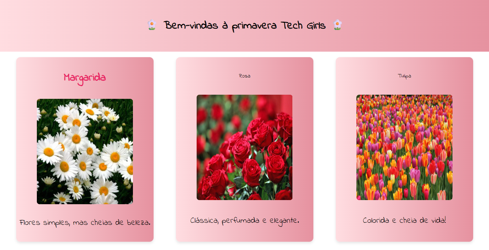

# 🌸 Desafio Tech Girls – Primavera no Código 🌸

Boa tarde, Tech Girls! ✨💻  
Este repositório contém a **minha solução** para o desafio da primavera, proposto pela comunidade **Tech Girls + Vai na Web**.  

O objetivo foi **corrigir o código HTML e CSS fornecido**, ajustando as tags quebradas e as propriedades `flex` que estavam escritas de forma incorreta.  
O resultado final é uma página simples, florida e colorida 🌷🌼.

---

## 🚀 Sobre o desafio

🔹 Corrigir erros de **HTML** (tags abertas/fechadas incorretamente).  
🔹 Ajustar propriedades de **CSS Flexbox** que estavam com sintaxe errada.  
🔹 Utilizar **somente HTML e CSS** (sem JS, Sass, SCSS, etc).  
🔹 Deixar o código limpo e organizado para florescer na tela 🌸.

---

## 💻 Tecnologias utilizadas

- HTML5  
- CSS3 (com Flexbox)

---

## 📸 Resultado final

Aqui está o resultado final da minha solução:  

  


---

## 🌷 Como rodar o projeto

1. Clone este repositório:  
   ```bash
   git clone https://github.com/seu-usuario/seu-repo.git
Entre na pasta do projeto:

bash
Copiar código
cd seu-repo
Abra o arquivo index.html no navegador.

Pronto! Você verá a versão florida e corrigida do desafio 🌼✨

---

# 🎉 Créditos

Desafio proposto por @vai-na-web + @TechGirlsVNW 💜

---
Solução desenvolvida por Eduarda Fonseca.
